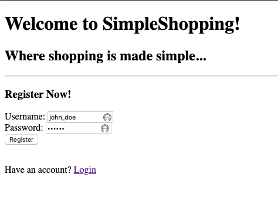
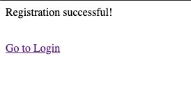
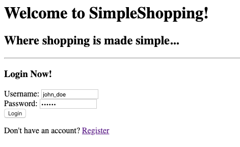
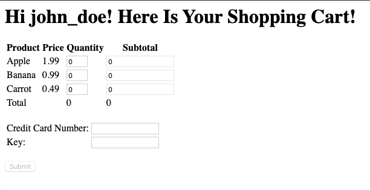
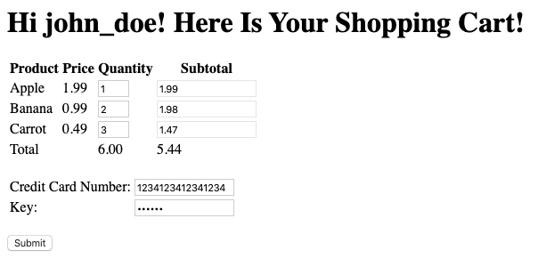
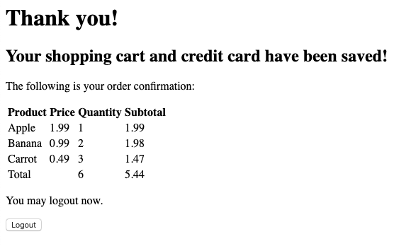

# SimpleShoppingCart
**by Jing Li s3676458**

## Introduction

This project creates a simple shopping cart website using PHP, Javascript, and HTML to demonstrate how sensitive information are encrypted and decrypted over the internet while shopping online. Since the main purpose of the project is to illustrate how security concepts are applied in e-commerce, there are certain implementations are unrealistic and should **never** be used in a production environment.

## Register

On the Register page, user needs to enter the username and password. The minimum length for the password is 6 characters.

Once the user clicks the **Register** button, the plaintext password will be hashed using SHA-256 before posting to the server. On the server, the posted username will be compared against existing users in the database, if the username hasn't been taken, the registration process is considered successful and the server will save the username and password to the database file and then inform and prompt the user to login.

In the database, the password is saved as the SHA-256 hash value as below:

`john_doe,8d969eef6ecad3c29a3a629280e686cf0c3f5d5a86aff3ca12020c923adc6c92`

Besides, for simplicity and to illustrate the shopping cart functionality, when a new user successfully registers, a default shopping cart with three default items will also be created and saved to a separate database file named as `{username}.txt` as follows:

`Apple:1.99:0,Banana:0.99:0,Carrot:0.49:0`

The format for an item is: `{item 1 name}:{unit price}:{quantity}` and multiple items need to be comma-separated as in the above example.

## Login

On the login page, the user needs to enter a correct combination of username and password. If either of the two is incorrect, the login will fail.

When the user clicks the **Login** button, the password again will be hashed using SHA-256. On the server side, it will first validate the username and password. If both correct, the shopping cart content will be retrieved. Then the server will redirect the user to the cart page, which is dynamically generated to display the shopping cart.

## Update Cart

Once the user logins successfully, she or he will be redirected to the Shopping Cart page.

On this page, the user can update the quantity for each of the items, and the **Subtotal** and **Total** will be automatically updated. Then the user can enter a 16-digit credit card number. Additionally, the user needs to enter a random number with a minimum length of 6 as the DES key, which will be used for encrypting/decrypting shopping cart content and credit card number.

Once the user is satisfied with the update, she or he can click the **Submit** button to save the changes. Before sending anything to the server, the shopping cart content and credit card number will be encrypted using the DES algorithm with entered DES key; The DES key itself will be encrypted using the RSA algorithm with the server's public key, which is pre-saved to the user's browser for simplicity. Then, the form information will be posted to the server for process.

On the server side, it will first decrypt the DES key using the RSA algorithm with its own private key, and then use the decrypted DES key to decrypt the shopping cart content and the credit card number. The cart content and credit card number will subsequently be saved to the database files. Once everything is saved, the server will redirect the website to a confirmation page with the updated cart content.

## Logout

The user can verify everything is correct and then choose to logout. If the user clicks the **Logout** button, the server will destroy the session and redirect the user to the login page again.

## Data Flow

